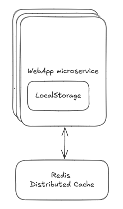

# Session Management API fix
Entrypoint: SessionController located in `src/main/java/com/webapp/backend/sessions/SessionController.java`

## Issues in the original code
1) Cross-service sync: 
this keeps its own local ConcurrentHashMap. 
If we scale horizontally this microservice, then Sessions are inconsistent across instances.
2) Error handling
No try/catch or logging if something fails (e.g., a downstream service).
3) Scalability
All data in memory may lead to memory leaks and imply no persistence.

## Proposed solution: Redis distributed cache + in-memory microservice sticky sessions
- Introduce a distributed cache (Redis) → Use Redis so that session state is shared cluster-wide. This makes sessions consistent between microservices and fault-tolerant.
   - Key: session:<userId>
   - Value: session ID (UUID)
   - TTL: 30 minutes

- Fallback strategy → If Redis is unavailable, gracefully fall back to an in-memory map.
This prevents a single-point failure but still logs a warning.

## Assumption
- Session is maintained active in Redis for 30 minutes TTL since last access
- No sync between localStorage and Redis after fallback to localStorage
- The load balancer is configured to use sticky sessions, so it ensures that requests from the same client are always routed to the same microservice instance to allow graceful fallback to in-memory store.

## Usage
1) Run the login API to create a session in redis.
2) Inspect the Redis container and have fun!! :)
  - `podman exec -it <redis-container-id> redis-cli`
  - `keys *` to see all keys
  - `get session:<userId>` to see the session ID for a user
  - `ttl session:<userId>` to see the remaining time to live for a session
  - `del session:<userId>` to delete a session
3) Run the validate API to check if a session is valid.
4) Run the logout API to delete a session.

If the microservice restart, or another service instance is used, the sessions are still valid as they are stored in Redis.

## Overall architecture
