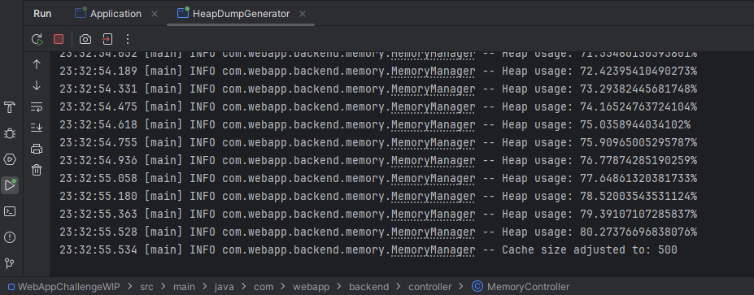
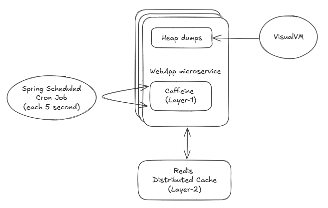
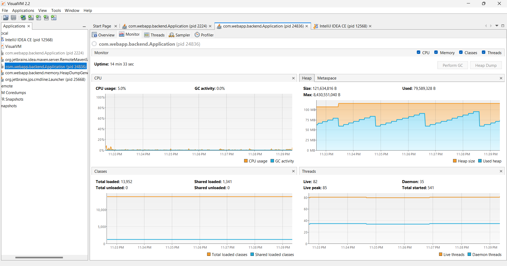

# Memory Management fix
Entrypoint: MemoryController located in `src/main/java/com/webapp/backend/controllers/MemoryController.java`

## Issues in the original code
- No profiling or logging or metrics: leaks are invisible until the microservice crashes.
- Large objects: 10 MB × thousands of sessions = easy exhaustion of heap.
- No eviction: The HashMap grows forever, nothing clears unless removeSessionData is called manually.

## Proposed solution and approach
- Use a two-layer caching strategy:
  - Caffeine for layer-1 caching (in-memory, super fast)
  - Redis for layer-2 caching (external, persistent, scalable)
- Caffeine is used to cache the most recently accessed session data, reducing latency for frequent requests.
- Redis is used to store all session data, providing a persistent and scalable solution.

### How to know if Caffeine cache is reaching the Heap limit
- Stats are collected via Micrometer 
- A scheduled job each 5 seconds is implemented to dynamically size the cache if heap usage exceeds 80%, by evicting less frequently used entries.
- In case of graceful degradation (i.e., Redis downtime), the application still serve content from local caffeine cache (but with possibility of cache miss!)
- Generate a heap dump file when the caffeine cache reach 80%, located in the folder /heap-dumps
  

## Assumption
- Microservice wants to remain stateless so Redis is a good fit again. Additional benefit of having layer-2 cache:
  - Persistent cache across microservice restarts (as Caffeine cache is cleared on restart)
  - Built-in eviction policies with TTL
  - No memory constraints, compared to in-memory caches (e.g., Caffeine, Guava) where the JVM heap is limited
- Caffeine effectiveness is strictly related to heap is small, there will be a lot of cache miss and Redis will be mostly used 

## Out of scope
- If Redis is down and Caffeine cache is full, we don't deal with cache misses, so the request will fail

## Usage
- Similar to example 1, via Swagger API or via dedicated HeapDumpGenerator class.
- Check the application logs for memory management logs, in the format:
  `2025-10-11T22:54:57.871+02:00  INFO 2224 --- [webapp-backend] [   scheduling-1] c.webapp.backend.memory.MemoryManager    : Heap usage: 0.47040483844814013%`

## Overall architecture of the proposal solution


## Visual VM as profiling tool
- Download Visual VM from https://visualvm.github.io/
- Start your application with the following JVM options to enable JMX:
  ```
  -Dcom.sun.management.jmxremote
  -Dcom.sun.management.jmxremote.port=9010
  -Dcom.sun.management.jmxremote.authenticate=false
  -Dcom.sun.management.jmxremote.ssl=false 
  ```
- Open VisualVM and connect to the running JVM process.
