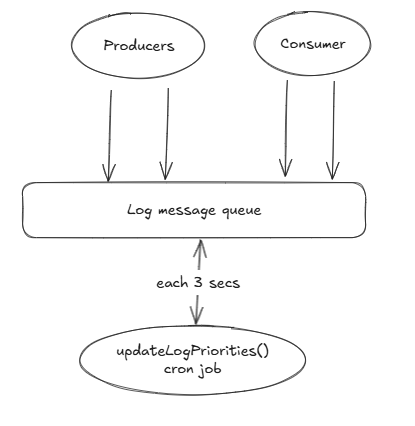

# Producer-Consumer Concurrency fix
Entrypoint: LogProcessorApplication located in `src/main/java/com/webapp/backend/concurrency/LogProcessorApplication.java`

## Issues in the original code
- FIFO only: cannot handle high-priority tasks first
- The system can't scale under concurrency (synchronized bottlenecks)

## Proposed Solution and Approach
The solution implemented addresses these issues by introducing:
- Thread-Safe Queue Processing with Prioritization:
   - A `PriorityBlockingQueue` is used to ensure thread-safe operations and automatic ordering of logs based on priority and timestamp.
- Dynamic Fairness:
   - Logs are dynamically promoted to higher priorities based on their age in the queue, preventing starvation of low-priority tasks.

### Key Changes
1. Task Representation:
   - The `Log` class represents the unit of work that producers generate and consumers process.
   - Each `Log` has a priority (`LOW`, `NORMAL`, `HIGH`, `CRITICAL`) and a timestamp for ordering.

2. Priority Queue:
   - The `PriorityBlockingQueue` ensures that logs are processed in order of priority, with ties broken by timestamp.

3. Dynamic Priority Updates:
   - A `ScheduledExecutorService` periodically checks the age of logs in the queue and promotes their priority if they have been waiting too long.

4. Producer-Consumer Model:
   - Multiple producers generate logs and add them to the queue.
   - Multiple consumers retrieve logs from the queue and process them.

## Out of scope
- if producers flood queue, consumers can lag indefinitely leading to starvation
- Unbounded queue may lead to memory exhaustion 

## Usage
1. Initialization:
    - The `LogProcessor` initializes the `PriorityBlockingQueue` and schedules periodic priority updates.
    - Producers and consumers are started as separate threads.

2. Producers:
    - Producers generate logs with varying priorities and add them to the queue.

3. Consumers:
    - Consumers retrieve logs from the queue and process them, ensuring higher-priority logs are handled first.

## Overall architecture of the proposal solution
