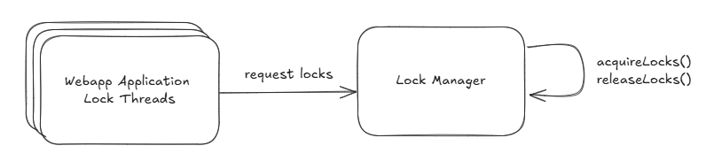

# Deadlock fix

## Issues in the original code
Deadlock setup:
  - Thread 1 locks Resource A and waits for Resource B
  - Thread 2 locks Resource B and waits for Resource A

Then:
  - Thread 1 tries to acquire lock2 → blocked, since Thread 2 owns it. 
  - Thread 2 tries to acquire lock1 → blocked, since Thread 1 owns it.

## Proposed Solution and Approach
1) Consistent lock ordering: the service always acquire locks in the same global order
   - This would prevent circular wait conditions
   - However, it requires careful design to ensure all parts of the code follow the same order which can be a high maintenance burden
2) Try-lock with timeout: Attempt to acquire all required locks at the same time
   - If unable to acquire all locks, release any acquired locks and retry after a random backoff period
   - Prevents deadlock by avoiding indefinite waiting

Solution 2 is chosen for its flexibility and ease of implementation in complex systems where lock ordering may be hard to enforce.

### Retry with backoff implementation details
- Each thread will attempt to acquire all required locks using `tryLock()` but this may still fail if another thread holds one of the locks. Example output:
```
Thread-1 acquired locks: [java.util.concurrent.locks.ReentrantLock@7dd9666e[Locked by thread Thread-1], java.util.concurrent.locks.ReentrantLock@79e6fd0d[Locked by thread Thread-1], java.util.concurrent.locks.ReentrantLock@3ce46c55[Locked by thread Thread-1]]
Thread-1 released locks: [java.util.concurrent.locks.ReentrantLock@7dd9666e[Locked by thread Thread-1], java.util.concurrent.locks.ReentrantLock@79e6fd0d[Locked by thread Thread-1], java.util.concurrent.locks.ReentrantLock@3ce46c55[Locked by thread Thread-1]]
Thread-2 failed to acquire locks.
Thread-2 released locks: [java.util.concurrent.locks.ReentrantLock@7dd9666e[Locked by thread Thread-1], java.util.concurrent.locks.ReentrantLock@79e6fd0d[Locked by thread Thread-1], java.util.concurrent.locks.ReentrantLock@3ce46c55[Locked by thread Thread-1]]
```
- If unable to acquire all locks, it releases any acquired locks and retries after a random backoff period
- This prevents deadlock by avoiding indefinite waiting 
- The number of retries and backoff strategy (random, exponential, fixed) can be tuned based on application needs
```
Thread-1 acquired locks: [java.util.concurrent.locks.ReentrantLock@6e2ba68[Locked by thread Thread-1], java.util.concurrent.locks.ReentrantLock@2dd3e6c[Locked by thread Thread-1], java.util.concurrent.locks.ReentrantLock@47dfb053[Locked by thread Thread-1]]
Thread-2 failed to acquire locks. Retrying...
Thread-1 released locks: [java.util.concurrent.locks.ReentrantLock@6e2ba68[Unlocked], java.util.concurrent.locks.ReentrantLock@2dd3e6c[Unlocked], java.util.concurrent.locks.ReentrantLock@47dfb053[Unlocked]]
Thread-2 released locks: [java.util.concurrent.locks.ReentrantLock@6e2ba68[Unlocked], java.util.concurrent.locks.ReentrantLock@2dd3e6c[Unlocked], java.util.concurrent.locks.ReentrantLock@47dfb053[Unlocked]]
Thread-2 acquired locks: [java.util.concurrent.locks.ReentrantLock@6e2ba68[Locked by thread Thread-2], java.util.concurrent.locks.ReentrantLock@2dd3e6c[Locked by thread Thread-2], java.util.concurrent.locks.ReentrantLock@47dfb053[Locked by thread Thread-2]]
Thread-2 released locks: [java.util.concurrent.locks.ReentrantLock@6e2ba68[Unlocked], java.util.concurrent.locks.ReentrantLock@2dd3e6c[Unlocked], java.util.concurrent.locks.ReentrantLock@47dfb053[Unlocked]]
```

### What if third-party libraries also using locks
Proposed solution:
- First acquire external library locks, then acquire internal locks

## Usage
- Run DeadLockApplication class located in `src/main/java/com/example/deadlock/DeadLockApplication.java`

## Overall architecture of the proposal solution
