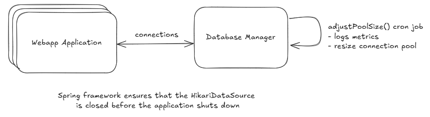

# Database fix
Entrypoint: The `ConnectionMonitor` class (`src/main/java/com/webapp/backend/database/ConnectionMonitor.java`) periodically adjusts the connection pool size based on usage patterns.

## Issues in the original code
1. Connection Leaks: Connections were not always closed properly if an exception before the connection is assigned, leading to potential resource exhaustion.
2. Monitoring: Lack of visibility into the connection pool usage, making it difficult to detect and address issues like high contention or connection leaks.

## Solution
- Graceful Shutdown: the @PreDestroy method in HikariCPConfig ensures that the connection pool is closed properly when the application shuts down.
- Monitoring and resizing: the ConnectionMonitor class periodically logs the connection pool metrics, providing visibility into the pool's usage and helping to identify potential issues. 
Furthermore, it also resize the maximum pool size based on the current usage patterns.

## Usage
1. Start the application.
2. Check the logs to see the database connection pool metrics, which are logged every 10 seconds. Example log output:
   ```
   2025-10-11T23:10:00.123+02:00  INFO 2224 --- [webapp-backend] [   scheduling-1] c.w.backend.database.ConnectionMonitor   : Active connections: 0, Waiting threads: 0, Current max pool size: 10
   ```

## Overall architecture of the proposal solution
